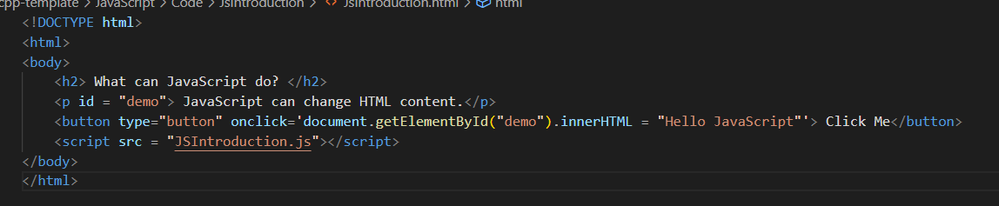

# W3Schools JavaScript
## JSHome
### JavaScript is the world's most popular programming language
### JavaScript is the programming language of the web
### JavaScript is easy to learn
### This tutorial will teach you JavaScript from basic to advanced (Tutorial : Hướng dẫn)
## JSIntroduction
### JavaScript can change HTML Content -> getElementById() : Find by Id and replace with new

#### Note: 
##### h2 : Level 2 Heading
##### p : paragraph
##### button
##### JavaScript accepts both double and single quotes (quotes: dấu ngoặc kép)
