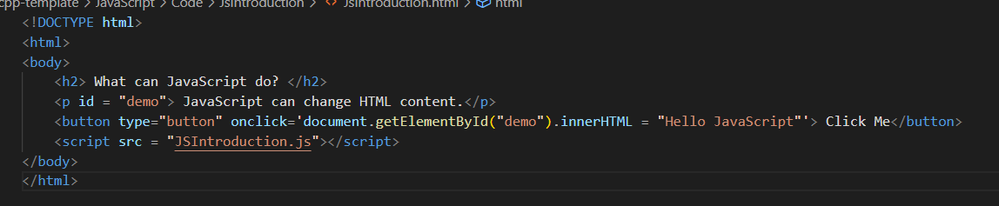
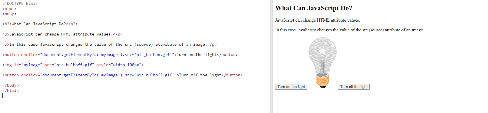
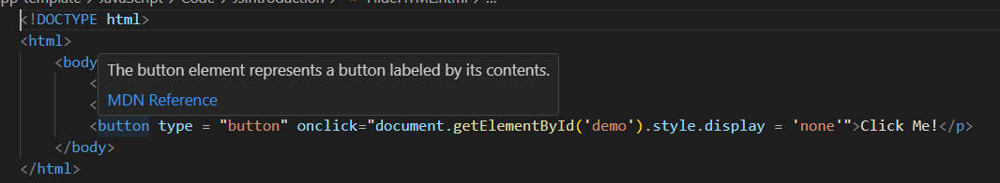
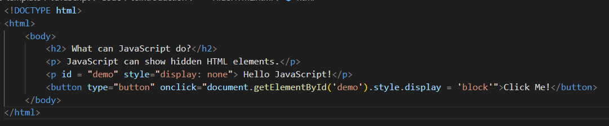
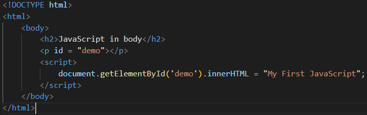
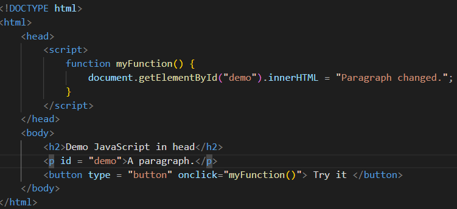
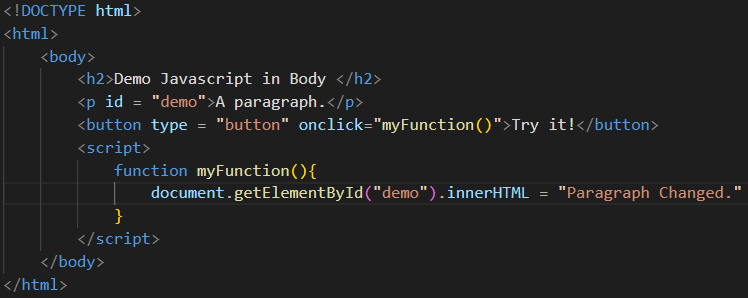
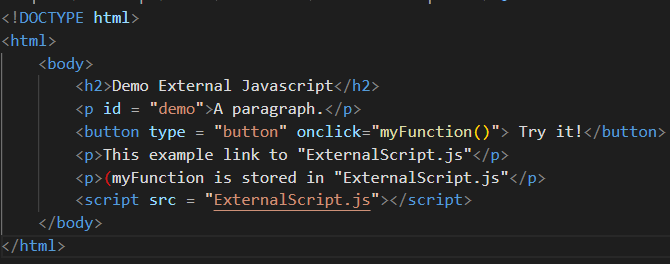
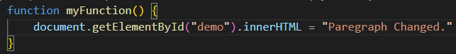
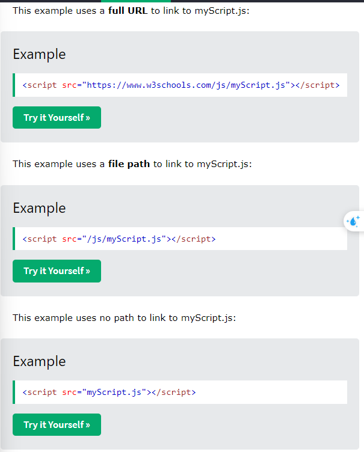

# W3Schools JavaScript
## JSHome
### JavaScript is the world's most popular programming language
### JavaScript is the programming language of the web
### JavaScript is easy to learn
### This tutorial will teach you JavaScript from basic to advanced (Tutorial : Hướng dẫn)
## JSIntroduction
### JavaScript can change HTML Content -> getElementById() : Find by Id and replace with new

####    Note: 
#####       h2 : Level 2 Heading
#####       p : paragraph
#####       button
#####       JavaScript accepts both double and single quotes (quotes: dấu ngoặc kép)
### JavaScript can change HTML attribute values (attribute: Thuộc tính)

### JavaScript can change HTML style (CSS)

### JavaScript can Hide HTML elements:

### JavaScript can show HTML elements:

## JS Where To 
### The script tag:

### JavaScript Functions and Events:
#### A Javascript function a block of Javascript code, that can be executed when "called" for. (block: Khối, executed: thực thi)
#### For example, a function can be called when an event occurs, like when the user clicks a button. (occurs: xảy ra) 
#### JavaScipt in head or body
##### You can place any number od scripts in an HTML document.
##### Script can be placed in the body, or in thr head section of an HTML page, or in both. (section: phần)
##### Javascript in head

##### JacaScript in body

###### Note: Placing script at the bottom of the body element improves the display speed, because script interpretation slows down the display. (interpretation: diễn dịch)
### External JavaScript
#### Script can also be placed in external files
#### External scripts are practical when the same code is used in many different web pages.
#### JavaScript file have the file extension .js (extension: sự mở rộng)
#### To use an external script, put the name of the script filr in the src (source) attribute of a script tag: 
#### You can place an external script reference in head or body as you like. (reference: Sự liên quan)
#### The script will behave as if it was located exactly where the script tag is located. (behave as if it: Hoạt động như thể)
#### Note: External script cannot contain script tag. (contain: bao gồm)
#### HTML

#### .js

### External JavaScript Advantages
#### Placing scripts in external files has some advantages: (advantages)
##### It separates HTML and code (separate: tách ra)
##### It makes HTML and Javascript easier to read and maintain (maintain: Duy trì)
##### Cached JavaScript files can speed up page loads
### External References:
#### An external script can be referenced in different ways:
##### With a full URL (a full web address)
##### With a file path (like/js/)
##### Without any path
#### Example:

