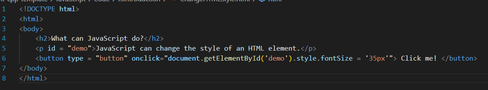

# W3Schools JavaScript
## JSHome
### JavaScript is the world's most popular programming language
### JavaScript is the programming language of the web
### JavaScript is easy to learn
### This tutorial will teach you JavaScript from basic to advanced (Tutorial : Hướng dẫn)
## JSIntroduction
### JavaScript can change HTML Content -> getElementById() : Find by Id and replace with new

####    Note: 
#####       h2 : Level 2 Heading
#####       p : paragraph
#####       button
#####       JavaScript accepts both double and single quotes (quotes: dấu ngoặc kép)
### JavaScript can change HTML attribute values (attribute: Thuộc tính)

### JavaScript can change HTML style (CSS)

### JavaScript can Hide HTML elements:

### JavaScript can show HTML elements:

## JS Where To 
### The script tag:

### JavaScript Functions and Events:
#### A Javascript function a block of Javascript code, that can be executed when "called" for. (block: Khối, executed: thực thi)
#### For example, a function can be called when an event occurs, like when the user clicks a button. (occurs: xảy ra) 
### JavaScipt in head or body
#### You can place any number od scripts in an HTML document.
#### Script can be placed in the body, or in thr head section of an HTML page, or in both. (section: phần)
### Javascript in head

